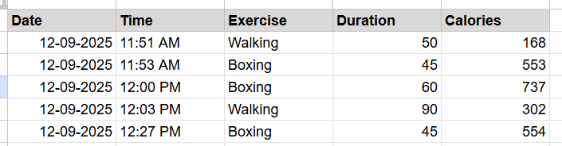

# ᯓ🏃🏻‍♀️‍➡️ AI Workout Tracker


An AI-powered workout tracking app built in Python that converts natural language exercise descriptions into structured workout data and logs them automatically to a Google Sheet using Sheety.

This project demonstrates:
- API integrations
- Secure environment variable handling
- Natural language exercise parsing
- Authenticated cloud data persistence
- End-to-end data pipelines

---

## Features

- Natural language workout input
> *"lifted weights for an hour and ran 3 miles"*
- Automatic calorie estimation via Nutritionix
- Timestamped workout logging
- Secure authenticated writes to Google Sheets via Sheety
- Human-readable date + AM/PM time formatting
- Environment variable protection for all secrets


---

## Tech Stack

- **Python 3.11**
- **Requests** – API communication
- **python-dotenv** – Environment variable management
- **Nutritionix API** – AI exercise parsing + calorie estimation
- **Sheety API** – Google Sheets automation
- **Git + GitHub** – Version control

---

## 📦 Setup Instructions

### 1. Clone the repo

```bash
git clone https://github.com/lesliejohnson-io/workout-tracker.git
cd workout-tracker
````

---

### 2. Create a virtual environment

```bash
python -m venv .venv
.venv\Scripts\activate   # Windows
```

---

### 3. Install dependencies

```bash
pip install -r requirements.txt
```

---

### 4. Create a `.env` file

```env
APP_ID=your_nutritionix_app_id
API_KEY=your_nutritionix_api_key
BASE_URL=https://app.100daysofpython.dev

TRACKER_ENDPOINT=your_sheety_endpoint
SHEETY_KEY=your_sheety_bearer_token
```


## ▶️ Running the App

```bash
python workout-tracker.py
```

Example input:

```
Tell me about your exercise: lifted weights 60 min
```

✅ Automatically logs your workout to your spreadsheet
✅ Displays API status + confirmation output

---

## Data Logged to Google Sheets

Each entry logs:

* Date
* Time
* Exercise name
* Duration (minutes)
* Estimated calories burned

This makes the project analytics-ready for future dashboards.

---

## Security

* No secrets are committed
* All keys live in `.env`
* Bearer-token authentication used for Sheety

---

## Future Enhancements

* Weekly workout summaries
* Training load analysis
* Recovery trend detection
* Visualization dashboard
* Mobile-friendly frontend

---
